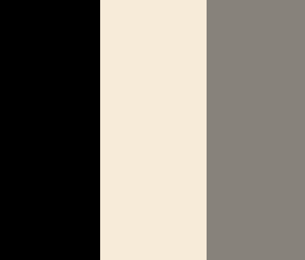
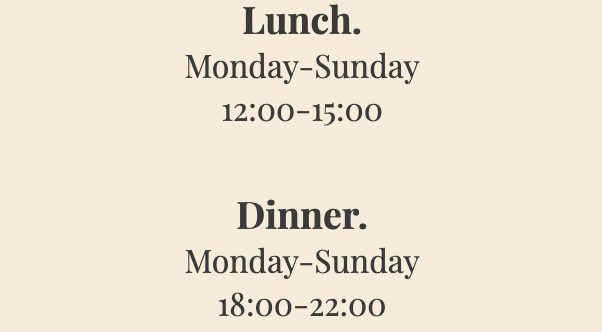

# Husk website

This the website for Husk. A contemporary fine dining restaurant in Surrey.
The purpose of the website is to catch the eye of a potential customer, with bold high quality photos of our food, interior design and cocktails. The design behind the website is simplicity, eye-catching and easily navigable. The aim of the website is to showcase our work, give brief information about Husk and to make a reservation with ease.

## Target Audience.

As Husk is a casual fine dining restaurant, the target audience is quite vast, anyone who anyone who appreciates food and the finer details in haute cuisine is the target audience. Pricing is on the higher side but not to deter any potential guest from experiencing Husk, the price point is set to the standards we live by such as sustainable produce. Husk is not to be dined at daily or weekly, it is an experience. Our customers are here for celebrations, anniversary or just simply to enjoy a world class dining experience.

## User Stories.

The website will update with time as the menu changes seasonally, but the core of the website will stay the same and returning user and first time user will benefit from the ease of navigation nad infomation.

### As a couple looking for a restaurant to celebrate our wedding anniversary.

The site is fluid to work with, easy and to the point from the first page of brief explanation into what Husk is about, to the menu page to see the current seasonal menu on display, with the gallery page showcasing the current dishes that you will recieve to the booking button or reservation tab to easily making a reservation.

## Design

### General Structure

- All colours and shades throughout the website are harmonious, with a deep earthy tone, from the plates in the images of the dishes to the hero images are each page, all linked giving a sense of consistency.

- A serif font has been used throughout as it give is a more upclass feel to the website, with clean spacing.
- the design of the website is to be as minimal as possible, it is to be direct and to the point for the user to find infomation and make a reservation based on that information.

### Colour Palette.

The colour palette I went with was a variation of whites and blacks, so that all the other elements are accentuated, such as the logo, images and menu structure.

### Typography.

I used Noto Serif, because of it's readability, and that it does not get lost on a white background, for its application for a fine dining restaurant, it is a classy, classic font.

### Wire frame

- The structure of the website with all pages having hero images besides the Gallery give the website consistancy.

## Features

- Navigation Bar.
  - The navigation bar is fully responsive over all the pages on the website on mobile, tablets and phones. The navigation bar includes links to each of the pages and the logo, from home, menu, gallery, reservations.
  - It is designed for the user to navigated the website with ease over all devices and screen sizes.

- Landing page of Husk.
  - This page includes an image of the interior design of the restaurant with aa text overlay clearly describing that what the website is about.
  - The landing page image is clear and precise and attracts the user to the page with visual information.

- Infomation section.

  - This section is a clear indication of what the restaurant is about. with images and a brief desciption it give the user infomation without overwhelming them.
  - This section is designed to grab the attention of the user and make the a potentional customer with and explanation into what the restaurant is about.

- Opening times section.

  - The section is set up in the way it is to show the user the information they are looking for quickly, with no diversion.

- Reservation button

  - A link feature to bring the user directly to the reservation page.

- The footer.
  - This section includes direct links to social media site of Husk.
  - All links open in a new tab.

- Menu page.
  - This page informs the user of what they can expect as a customer dining in the restaurant, by price, each dish with brief description, and service charge.
  - The page helps the user easily identify what type of restaurant they will be dining at with the structure of infomation provided.

- Gallery page
  - This page provides the user with visual information on to expect at Husk, with HD photography of food, drinks and kitchen in action.

- Reservation page.
  - This page allows the user to make a reservation to the restaurant. the user will be asked to input personal information regarding the reservation.

### Testing.

- Testing was done on different browsers, such as Safari and Chrome with no faults.
- The website is responsive on all screen sizes on all devices from mobile, tablet, and desktop screens.
- All pages on the website work, including links, functionality, accessability and readability.
- All entries on the form are specific such as an email entry will only be accepted for the email section and for phone number ,this includes phone number pattern for UK numbers.

### Bugs.

- I did not come across anything major during coding, I did come across a formatting issue, causing self closing bracket to move, and odd spacing and tabbing.

- The cause was the auto formatting was taking place during manual save, it was fixed by changing it to prettier formatting.

### Validator testing.

- HTML.
- No errors during testing the HTML code through W3C valiator

- CSS.

* No errors during testing CSS code through Jigsaw validator

- Lighthouse score.

- Wave summary.

- Accessability.
- I tested visability and accessablity through Wave and no contrast errors, errors or popped up.

### Technologies and Languages used.

- Github - used for repositories and deployment of website through github pages.
- Codeanywhere - IDE used for writing code.
- HTML - Language used for structure of website.
- CSS - Language used for styling the structure of the website.
- Font Awesome - Used for custom fonts within the website such as website links.
- Google Fonts - used for typography throughout the website.
- Favicon Generator - favicon.io was used to generate my favicon file and code.

### Unfixed bugs.

- No unfixed bugs.

  ### Deployment

  Husk is deployed on GitHub Pages.

  - Steps to deploy :
  - Navigate to the settings tab.
  - Got to source section and select master branch.
  - Once the master branch is selected the site will be live.

  * Live link to Husk can be found here: <https://alessandr095.github.io/Husk/>

### Credits.

- Code for the nav bar and drop down toggle were used from CI Love Running Project.
- Code for the Gallery responsivness was used from CI Love Running project.
- Indepth flex box infomation from W3C.
- Form semantics from developer.mozilla.

### Media.

- All media for Husk website was used from Pintrest.

### Problems.

I have an issue with my branch diverting while updating my readme file, I could not get around the problem of my readme edits not changing on GitHub so I uploaded the edited file straight to GitHub and that is when the problem occurred. I eventually fixed in by myself, but had to go through a few hoops, that is why there are multiple “test” commits, I was trying to fix the problem, which I eventually did fix.
