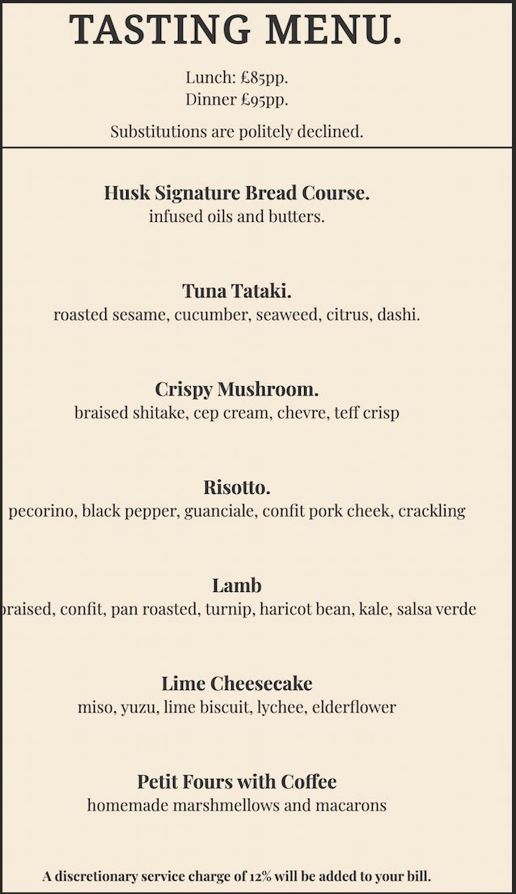

# Husk website

This the website for Husk. A contemporary fine dining restaurant in Surrey.
The purpose of the website is to catch the eye of a potential customer, with bold high quality photos of our food, interior design and cocktails. The design behind the website is simplicity, eye-catching and easily navigable. The aim of the website is to showcase our work, give brief information about Husk and to make a reservation with ease.

## Features

- Navigation Bar.
  - The navigation bar is fully responsive over all the pages on the website on mobile, tablets and phones. The navigation bar includes links to each of the pages and the logo, from home, menu, gallery, reservations
  - it is designed for the user to navigated the website with ease over all devices and screen sizes

- Landing page of Husk.
  - This page includes an image of the interior design of the restaurant with aa text overlay clearly describing that what the website is about.
  - The landing page image is clear and precise and attracts the user to the page with visual information.

- Infomation section.

  - This section is a clear indication of what the restaurant is about. with images and a brief desciption it give the user infomation without overwhelming them.
  - This section is designed to grab the attention of the user and make the a potentional customer with and explanation into what the restaurant is about.

- Opening times section.

  - the section is set up in the way it is to show the user the information they are looking for quickly, with no diversion.

- Reservation button

  - a link feature to bring the user directly to the reservation page

- The footer.
  - This section includes direct links to social media site of Husk.
  - all links open in a new tab.

- Menu page.
  - This page informs the user of what they can expect as a customer dining in the restaurant, by price, each dish with brief description, and service charge.
  - the page helps the user easily identify what type of restaurant they will be dining at with the structure of infomation provided.

- Gallery page
  - this page provides the user with visual information on to expect at Husk, with HD photography of food, drinks and kitchen in action.

- Reservation page.
  - This page allows the user to make a reservation to the restaurant. the user will be asked to input personal information regarding the reservation.

## Design

### General Structure.

- All colours and shades throughout the website are harmonious, with a deep earthy tone, from the plates in the images of the dishes to the hero images are each page, all linked giving a sense of consistency.

* A serif font has been used throughout as it give is a more upclass feel to the website, with clean spacing.
* the design of the website is to be as minimal as possible, it is to be direct and to the point for the user to find infomation and make a reservation based on that information.

- Snippets of colour pallet.

    

### Wire frame.

- the structure of the website with all pages having hero images besides the Gallery give the website consistancy.
